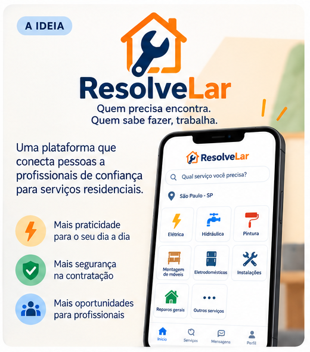
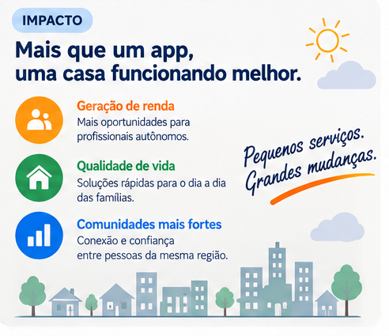

  

## Equipe
* Marcus Vinícius Alves Silva
* Maria Clara Miguel Silva
* João Paulo Souza Selvati
* Luiza Oliveira de Souza Garcia

## 1. Visão Geral da Startup

  

  A ResolveLar é uma plataforma digital que conecta pessoas que precisam de serviços de manutenção residencial a profissionais disponíveis para realizá-los. O aplicativo reúne diferentes tipos de serviço em um único ambiente, permitindo que o cliente encontre profissionais, solicite atendimento, receba orçamentos, escolha um prestador, agende o serviço e avalie o atendimento.

 

## 2. Problema e Motivação

  

  Encontrar um profissional para resolver um problema dentro de casa ainda depende, muitas vezes, de indicações informais, grupos de mensagens ou buscas dispersas na internet. Quando surge um problema como um chuveiro queimado ou um vazamento, o contratante precisa descobrir quem presta o serviço, se atende a região, qual a disponibilidade, o custo e a confiabilidade do profissional. Do outro lado, diversos prestadores autônomos precisam encontrar clientes e construir uma reputação digital.

  Esse cenário de desorganização ocorre em um mercado em plena transformação digital. Segundo o módulo temático "Trabalho por Meio de Plataformas Digitais" da PNAD Contínua, do IBGE, cerca de 1,7 milhão de pessoas trabalhavam por meio de plataformas digitais de serviços no 3º trimestre de 2024, um crescimento de 25,4% em relação a 2022 [1]. Dentro desse total, o segmento de "serviços gerais ou profissionais" — categoria em que se enquadra a manutenção residencial — foi o que proporcionalmente mais cresceu no período, com expansão de 52,1% [1], reforçando a relevância do domínio escolhido pela ResolveLar.

  O levantamento "Sebrae em Dados" confirma o tamanho expressivo do mercado de manutenção residencial, historicamente fragmentado [2]. Já as diretrizes de apoio ao microempreendedor do Sebrae alertam para os impactos da vulnerabilidade na gestão de pequenos negócios [3], destacando a dificuldade de gerir a própria carteira de clientes de forma segura.

  No âmbito acadêmico, Abílio, Amorim e Grohmann (2021) discutem como a plataformização do trabalho reconfigura a informalidade brasileira, fazendo emergir uma "novíssima informalidade" marcada pela subordinação de trabalhadores informais a empresas e pela perda de formas estáveis de organização produtiva [4]. A ResolveLar nasce para atuar como um contraponto a essa precarização, buscando reduzir a distância entre quem precisa de um serviço e quem possui a capacidade de realizá-lo, garantindo ao prestador a construção de um histórico digital sólido e uma melhor gestão de sua agenda.

 

## 3. Impacto Social Esperado

  

  A proposta atua principalmente em dois aspectos de impacto. O primeiro é a geração de oportunidades de trabalho para prestadores de serviços, especialmente profissionais autônomos que possuem conhecimento técnico, mas têm dificuldade para encontrar novos clientes. O segundo é a facilitação do acesso da população a serviços de manutenção residencial, centralizando busca, disponibilidade, orçamento e reputação em uma única plataforma.

<strong>Quem é beneficiado:</strong>

<ul>
  <li><strong>Contratantes:</strong> Pessoas que necessitam de manutenção ou pequenos serviços em suas residências e querem encontrar profissionais disponíveis de maneira rápida e organizada.</li>
  <li><strong>Prestadores:</strong> Profissionais autônomos ou pequenos prestadores de serviço que desejam aumentar sua exposição, encontrar clientes e organizar seus atendimentos.</li>
</ul>

<strong>Como o impacto será medido (Indicadores):</strong>

  O impacto poderá ser acompanhado por indicadores como quantidade de profissionais ativos, quantidade de serviços concluídos e quantidade de solicitações atendidas. Também serão avaliados o tempo médio entre solicitação e contratação e a avaliação média dos serviços.

 

## 4. Esboço da Solução

A ResolveLar não será apenas um catálogo de profissionais, acompanhando todo o ciclo da contratação.

*Jornada de Uso:*
1. O cliente descreve o problema, informa a localização, a categoria do serviço (a partir de uma lista) e uma preferência de data.
2. A plataforma apresenta os profissionais compatíveis com aquela categoria que atendem a região informada.
3. O cliente consulta o perfil dos profissionais (avaliações, serviços realizados) e solicita orçamento a um ou mais prestadores.
4. Cada prestador que recebe a solicitação analisa o serviço e envia sua proposta, com valor e prazo estimados.
5. O cliente escolhe uma das propostas recebidas; a plataforma verifica a disponibilidade do profissional e confirma o agendamento.
6. Ao concluir o serviço, o prestador confirma a finalização da execução; em seguida, o cliente confirma o recebimento, e ambos podem avaliar a experiência.

## 5. Esboço da Arquitetura

A ResolveLar será estruturada utilizando uma arquitetura baseada em
microsserviços, com API Gateway, clientes distintos para contratantes
e prestadores e bancos de dados independentes por serviço.

➡️ [Visualizar o esboço da arquitetura](arquitetura.md)

## 6. Instruções de Execução

Em progresso — As instruções completas para levantar a arquitetura de microsserviços via Docker-Compose e Kubernetes local serão atualizadas nas próximas entregas.

## Referências

1. IBGE. Trabalho por Meio de Plataformas Digitais 2024 (PNAD Contínua, 3º trimestre de 2024). Rio de Janeiro: IBGE, 2025. Disponível em: https://agenciadenoticias.ibge.gov.br/media/com_mediaibge/arquivos/59722d4ac24bd853f52f54f12b9514f7.pdf
2. SEBRAE. Sebrae em Dados: Serviços de Manutenções Residenciais. 2022. Disponível em: https://sebraepr.com.br/comunidade/artigo/sebrae-em-dados-servicos-de-manutencoes-residenciais
3. SEBRAE. Impactos da Pejotização: Guia Completo para Micro e Pequenos Empreendedores. 2025. Disponível em: https://sebraepr.com.br/impulsiona/impactos-da-pejotizacao-guia-completo-para-micro-e-pequenos-empreendedores/
4. ABÍLIO, L. C.; AMORIM, H.; GROHMANN, R. Uberização e plataformização do trabalho no Brasil: conceitos, processos e formas. Sociologias, Porto Alegre, 2021. Disponível em: https://seer.ufrgs.br/index.php/sociologias/article/view/116484
