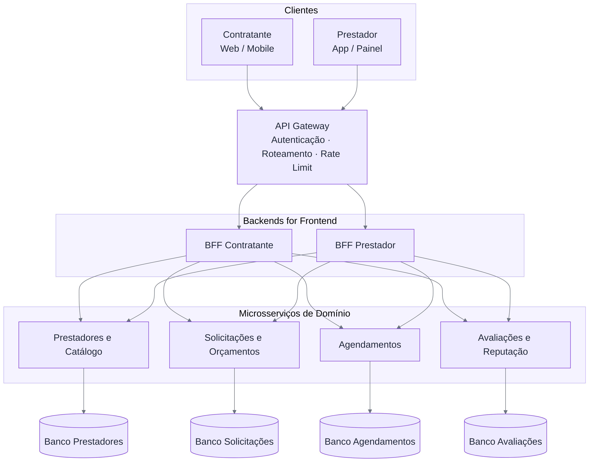

# Esboço da Arquitetura

A ResolveLar será estruturada como um sistema distribuído baseado em microsserviços, com um API Gateway como ponto único de entrada, dois clientes distintos (Contratante e Prestador), dois Backends for Frontend e um banco de dados independente por microsserviço.

## Visão Geral

  

## Componentes

### Clientes

- **Contratante** — aplicação Web/Mobile, usada por quem precisa contratar um serviço residencial.
- **Prestador** — aplicação Web/Mobile, usado pelo profissional autônomo ou pequeno prestador.

### API Gateway

Ponto único de entrada da plataforma, responsável por rotear as requisições para os BFFs corretos e concentrar preocupações transversais como autenticação e rate limiting.

### Backends for Frontend (BFF)

- **BFF Contratante** — agrega e formata dados para a jornada de busca, orçamento e agendamento do lado do contratante.
- **BFF Prestador** — agrega e formata dados para a jornada de recebimento de solicitações, envio de propostas e gestão da agenda do prestador.

A separação se justifica porque os dois clientes consomem informações e fluxos diferentes a partir dos mesmos serviços de domínio.

### Microsserviços de domínio

| Serviço | Responsabilidade |
|---|---|
| Prestadores e Catálogo | Cadastro de prestadores, categorias de serviço e busca por região/categoria. |
| Solicitações e Orçamentos | Registro da solicitação do contratante e das propostas enviadas pelos prestadores. |
| Agendamentos | Verificação de disponibilidade e confirmação do agendamento a partir da proposta escolhida. |
| Avaliações e Reputação | Registro da conclusão do serviço e das avaliações de contratante e prestador. |

Cada serviço possui banco de dados próprio (Database per Service), sem acesso direto de um serviço ao banco de outro.
