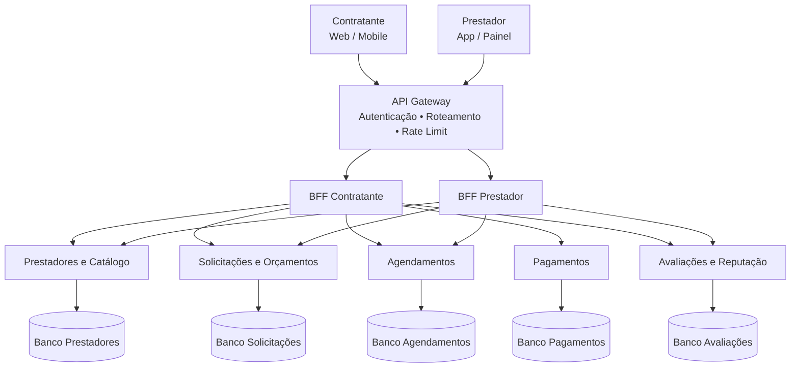

# Esboço da Arquitetura

Os usuários acessarão a plataforma por meio de um API Gateway, responsável por receber e direcionar as requisições para os serviços internos.

```mermaid
flowchart TB

    C["Contratante<br/>Web / Mobile"]
    P["Prestador<br/>App / Painel"]

    C --> G
    P --> G

    G["API Gateway<br/>Autenticação • Roteamento • Rate Limit"]

    G --> BC["BFF Contratante"]
    G --> BP["BFF Prestador"]

    BC --> PR
    BC --> SO
    BC --> AG
    BC --> PG
    BC --> AV

    BP --> PR
    BP --> SO
    BP --> AG
    BP --> AV

    PR["Prestadores e Catálogo"]
    SO["Solicitações e Orçamentos"]
    AG["Agendamentos"]
    PG["Pagamentos"]
    AV["Avaliações e Reputação"]

    PR --> DB1[("Banco Prestadores")]
    SO --> DB2[("Banco Solicitações")]
    AG --> DB3[("Banco Agendamentos")]
    PG --> DB4[("Banco Pagamentos")]
    AV --> DB5[("Banco Avaliações")]
```
